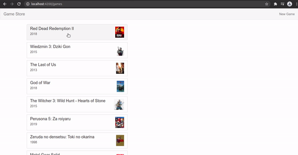
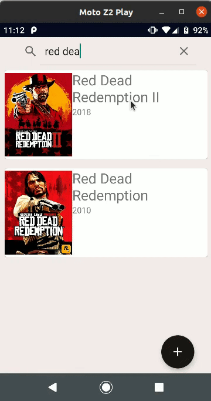

# Project Game Store

* Database in SQL
* Java/Spring Rest API: 
	More details: [RestAPI](https://github.com/IzaRam/game-store/tree/main/back-end/game-rest-api)
* Web Client
* Angular Web App
* Android Client

## Project Overview

* Web Store Client:

* Web Store Manager:

* Angular Store Manager App:

* Android Store Manager App:

